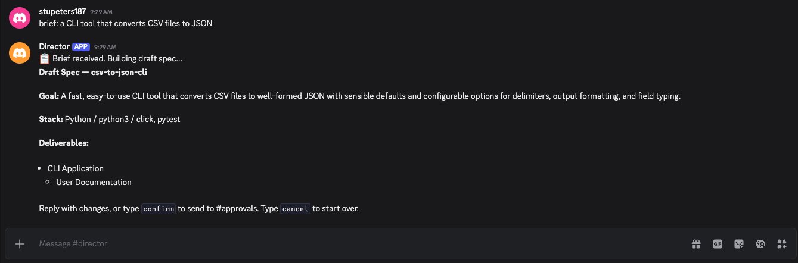
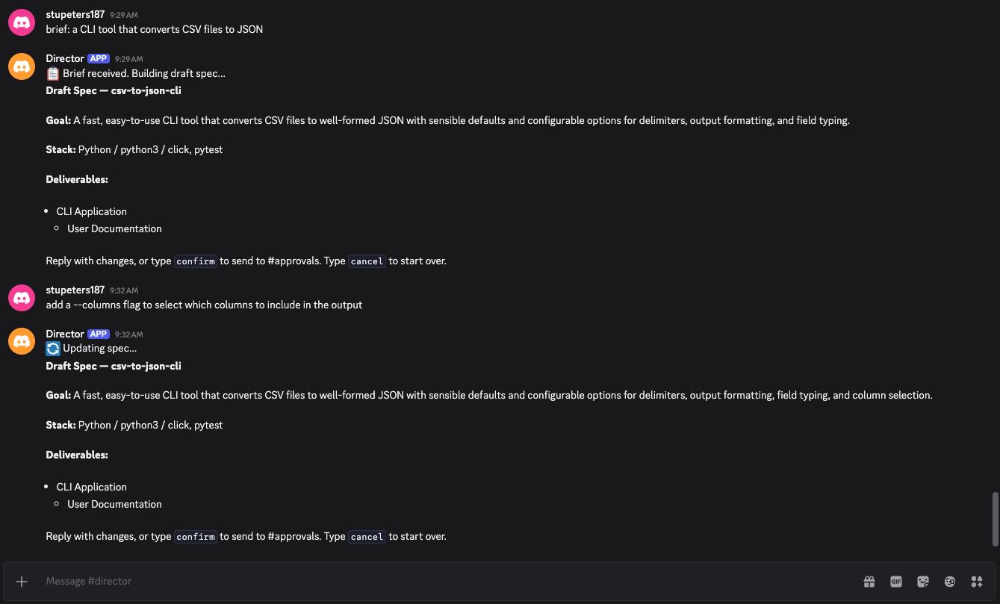
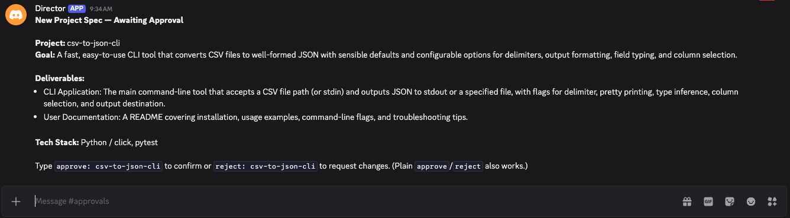
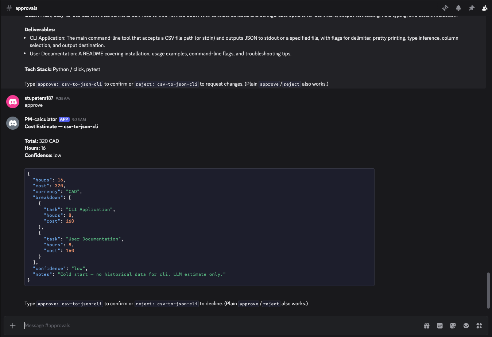
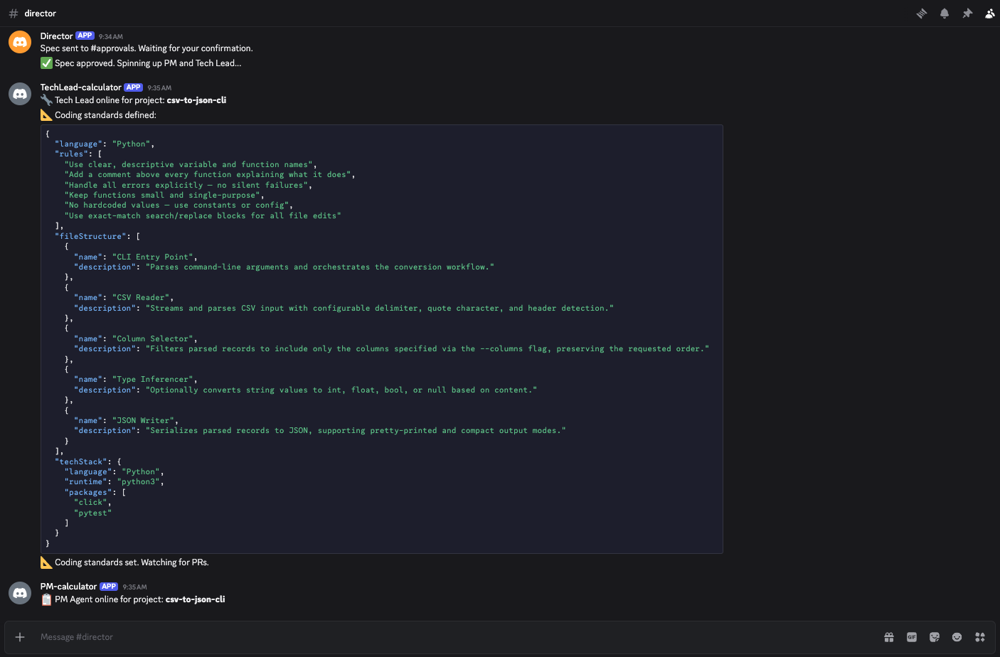
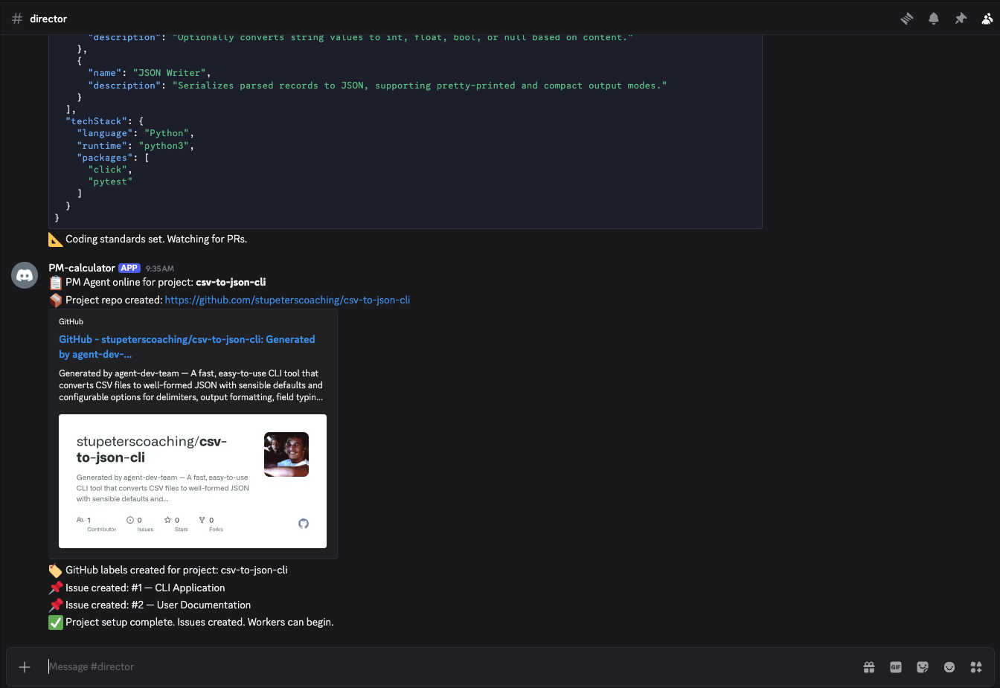

# agent-dev-team

> **Reference application within the [Bessemer](https://github.com/usebessemer) stack.** A live dogfood of the agent-role topology in practice, and the project that started this work. Kept as a maturity exemplar, not the current focus; the active stack is research → tooling ([icm-kit](https://github.com/usebessemer/icm-kit)) → [agent-classes](https://github.com/usebessemer/agent-classes).

[](https://github.com/usebessemer/agent-dev-team/actions/workflows/test.yml)

A tiered AI agent system that builds software projects autonomously. Define a project brief in Discord, and the team plans, builds, reviews, and ships it — with human approval gates at every major decision point.

Part of the [Bessemer Agentic](https://github.com/usebessemer) open source ecosystem.

---

## How it works

```
You type a brief in Discord
        ↓
Director builds a project spec → you approve
        ↓
PM creates a GitHub repo + Issues → cost estimate → you approve
        ↓
Workers spawn per Issue (Coder, Researcher, or Writer depending on label)
        ↓
Each worker: branch → work → PR (or Issue comment for research)
        ↓
Tech Lead reviews PRs → merges or rejects
        ↓
Tech Lead detects completion → notifies you
        ↓
You type close: {project-name} → project archived and closed
```

Every project gets its own GitHub repo and its own Discord channel (`#proj-{name}`), created automatically. The `agent-dev-team` repo stays clean as infrastructure only.

---

## Agent hierarchy

```
┌─────────────────────────────────────────┐
│            DIRECTOR                     │
│         (persistent)                    │
│  Receives briefs, builds specs,         │
│  spins up managers, handles close       │
└──────────────────┬──────────────────────┘
                   │
       ┌───────────┴───────────┐
       │                       │
┌──────▼──────┐         ┌──────▼──────┐
│  PM AGENT   │         │  TECH LEAD  │
│ (ephemeral) │         │ (ephemeral) │
│             │         │             │
│  Project    │         │  Coding     │
│  repo setup │         │  standards  │
│  Issues     │         │  PR review  │
│  Estimates  │         │  PR merge   │
└──────┬──────┘         └─────────────┘
       │
┌──────▼──────────────────────────────────┐
│          WORKER AGENTS (ephemeral)      │
│  One per GitHub Issue, routed by label  │
│                                         │
│  Coder       — type:feature (default)  │
│  Researcher  — type:research            │
│  Writer      — type:docs                │
└─────────────────────────────────────────┘
```

---

## Walkthrough

agent-dev-team turns a one-line brief into a working repository through a team of
Director, PM, Tech Lead, and Coder agents — coordinated in Discord, with you
approving at each gate. The screenshots below follow one example: the brief
"a CLI tool that converts CSV files to JSON".

### 1. Brief → draft spec
Post a one-line brief in `#director`. The Director generates a draft spec — goal,
tech stack, and deliverables.



### 2. Refine it conversationally
Reply with changes and the Director revises the spec in place — here, adding a
`--columns` flag. Iterate until it's right, then `confirm`.



### 3. Approve the spec
The confirmed spec moves to `#approvals` for your sign-off before any work begins.



### 4. Approve the estimate
The PM agent produces a cost-and-hours estimate. Nothing is built until you
approve it.



### 5. The team spins up
On approval, the PM and Tech Lead come online. The Tech Lead sets the coding
standards the Coder agents will follow.



### 6. Repo and issues created
The PM creates the project repository and breaks the spec into GitHub issues —
one per deliverable. Coder agents then pick up the issues and open pull requests.



---

## What runs on your machine

> **Important:** Coder and Tech Lead agents execute model-generated shell commands **directly on your host** inside a temporary directory. There is no container isolation. Do not run this system against untrusted issue content or on a machine where arbitrary code execution is unacceptable. Real sandbox isolation is planned for v1.8.

---

## Prerequisites

- [Node.js](https://nodejs.org) v18+
- [Ollama](https://ollama.com) running locally with models pulled **or** a Claude API key (`ANTHROPIC_API_KEY`)
- A Discord server with at least 3 channels: `#director`, `#approvals`, `#alerts`
- 3 Discord bots (Director, PM, Tech Lead) — see Discord setup below
- A GitHub personal access token with `repo` scope

---

## Discord setup

1. Create a Discord server with these channels:
   - `#director` — briefs, specs, status, close commands
   - `#approvals` — human confirmation gates
   - `#alerts` — worker escalations

   Per-project channels (`#proj-{name}`) are created automatically — you don't need to set them up.

2. Go to [discord.com/developers/applications](https://discord.com/developers/applications) and create 3 bots:
   - `Director`
   - `PM`
   - `TechLead`

3. For each bot:
   - Go to **Bot** → enable **Message Content Intent**
   - Copy the bot token
   - Go to **OAuth2 → URL Generator** → select `bot` scope + `Manage Channels` + `Manage Webhooks` permissions → invite to your server

4. Enable **Developer Mode** in Discord (**Settings → Advanced → Developer Mode**)

5. Right-click each channel and your server to copy IDs into your `.env` file

---

## Setup

```bash
# Clone the repo
git clone git@github.com:usebessemer/agent-dev-team.git
cd agent-dev-team

# Install dependencies
npm install

# Configure environment
cp .env.example .env
# Edit .env and fill in your tokens — see .env.example for all required values

# Run the test suite (no credentials needed — all external services are mocked)
npm test

# Start the system
npm start
```

---

## Usage

Once running, interact with the Director in your Discord `#director` channel:

```
# Start a new project (optional: name it with [brackets])
brief: [my-app] build a calculator with a web interface

# When prompted in #approvals, type:
approve   ← confirms spec
approve   ← confirms cost estimate

# Workers run autonomously. Watch progress in #proj-my-app on Discord
# and in the project repo on GitHub.

# When the Tech Lead posts completion in #director, review the project
# repo on GitHub, then type:
close: my-app
```

---

## Environment variables

See `.env.example` for the full list. Key variables:

```bash
# Discord bot tokens (required)
DIRECTOR_TOKEN=
PM_TOKEN=
TECHLEAD_TOKEN=

# Discord server
DISCORD_GUILD_ID=
DISCORD_CHANNEL_DIRECTOR=
DISCORD_CHANNEL_APPROVALS=
DISCORD_CHANNEL_ALERTS=

# GitHub (required)
GITHUB_TOKEN=           # personal access token with repo scope
GITHUB_OWNER=           # your GitHub username or org

# Inference — use Claude API, Ollama, or mix
ANTHROPIC_API_KEY=      # optional; enables Claude API for all agents
OLLAMA_BASE_URL=http://127.0.0.1:11434
DIRECTOR_MODEL=claude-opus-4-7   # or llama3.1:8b
MANAGER_MODEL=llama3.1:8b
WORKER_MODEL=llama3.2:latest

# Optional: separate GitHub account for Tech Lead formal reviews
# When set, Tech Lead uses APPROVE/REQUEST_CHANGES instead of comments
TECHLEAD_GITHUB_TOKEN=
```

---

## Project structure

```
agent-dev-team/
├── src/
│   ├── agents/
│   │   ├── director/       ← persistent Director agent
│   │   ├── managers/       ← PM and Tech Lead agents
│   │   └── workers/        ← Coder, Researcher, Writer agents
│   ├── config.js           ← env loading (loadEnv)
│   ├── discord/            ← Discord client utilities
│   └── pipeline/           ← orchestration and pollers
├── tests/                  ← Jest test suite (~0.3s, all external services mocked)
├── projects/
│   └── estimation-history.json
├── index.js                ← entry point
├── .env.example
├── ARCHITECTURE.md         ← full system design — read before touching code
├── ROADMAP.md              ← v1.x milestone plan and v2.x direction
├── CONTRIBUTING.md
└── LICENSE
```

---

## Known limitations (v1.5)

- **Workers execute on the host** — Coder and Tech Lead run model-generated shell commands directly on your machine in a tempdir. There is no container isolation. Real sandboxing is tracked for v1.8.
- **No test runners for non-Node projects** — Tech Lead runs `npm test` if a `package.json` exists; for any other stack it returns `passed: null` and auto-merges. Tracked for v1.10.
- **Estimation cold-start** — The historical mean requires 3+ past projects of the same `projectType`. New deployments always start with an LLM estimate; confidence improves as history grows.
- **Shared bot sessions** — PM and Tech Lead Discord sessions are global (`PM_TOKEN`/`TECHLEAD_TOKEN`). Concurrent projects share the same session; approval disambiguation uses the `approve: {project-name}` syntax. True session isolation requires separate tokens per project.
- **5-min polling fallback** — Webhooks are the primary trigger. Pollers run every 5 minutes as a safety net for dropped webhooks. Projects without `WEBHOOK_URL`/`GITHUB_WEBHOOK_SECRET` configured still rely on the poller.
- **Actuals not tracked** — On project close, `actuals` is written as a copy of the estimate (variance = 0). Tracked for v1.7.
- **Tech Lead self-approval** — when `TECHLEAD_GITHUB_TOKEN` is not set, Tech Lead posts a comment instead of a formal review (GitHub prevents self-approval). Set the optional separate token to enable formal `APPROVE`/`REQUEST_CHANGES` reviews.

---

## Architecture

See [ARCHITECTURE.md](./ARCHITECTURE.md) for the full system design.

## Roadmap

See [ROADMAP.md](./ROADMAP.md) for the v1.x milestone plan and v2.x direction.

---

## Contributing

See [CONTRIBUTING.md](./CONTRIBUTING.md).

---

## License

[MIT](./LICENSE) — Bessemer Agentic 2026
